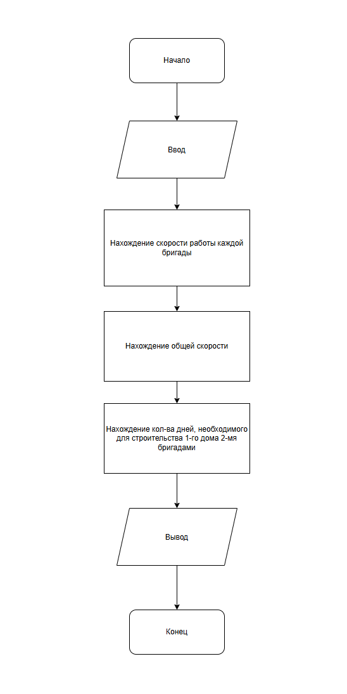

# Домашнее задание к работе 2
____

## Условие задачи
____

О двух бригадах строителей известно, что первая бригада может построить дом за Х
дней, а вторая за Y дней при одинаковом качестве. Определить сколько дней
потребуется для строительства этого дома двум бригадам вместе

## 1. Алгоритм и блок-схема
____

### Алгоритм

1. **Начало**
2. Объявить переменные:
   - `X` — количество дней, нужное 1-й бригаде на строительство дома.
   - `Y` — количество дней, нужное 2-й бригаде на строительство дома.
   - `unitProduction` — количество производимых единиц
3. Задать исходные данные:
   - `X = 12`
   - `Y = 15`
   - `unitProduction = 1`
4. Вычислить скорости работы каждой из бригад:
   - `float v1 = unitProduction / t1;`
   - `float v2 = unitProduction / t2;`
5. Найти общую скорость работы 2-х бригад вместе:
   - `float v12 = v1 + v2;`
6. Вычислить кол-во дней, требуемое для строительства 1-го дома 2-мя бригадами:
   - `float quantityDays = unitProduction / v12;`
8. Вывести результаты расчетов с подстановкой всех значений в текст.
9. **Конец**

### Блок-схема


 [Ссылка на блок-схему](https://app.diagrams.net/#G1gbS5uqZz5COACX76xFl9WXr6SDUFxvg3#%7B%22pageId%22%3A%22Rx9zcCg74zxVW4MSbvLp%22%7D)


## 2. Реализация программы

```c
#include <stdio.h>
#include <locale.h>

int findProductivity() {

	// Инициализация переменных

	float t1 = 12.; 
	float t2 = 15.;
	int unitProduction = 1;

	// Нахождение скорости работы каждой бригады (n-ная часть дома в день)

	float v1 = unitProduction / t1;
	float v2 = unitProduction / t2;

	// Нахождение скорости работы двух бригад вместе

	float v12 = v1 + v2;

	// Нахождение количества дней, требуемого для строительства 1-го дома двумя бригадами

	float quantityDays = unitProduction / v12;

	// Вывод результата

	printf("Количество дней, нужное для строительства 1-го дома первой бригадой: %.0f\n"
		"Количество дней, нужное для строительства 1-го дома второй бригадой: %0.f\n"
		"Скорость строительства первой бригады: %.2f дома в день\n"
		"Скорость строительства второй бригады: %.2f дома в день\n"
		"Общая скорость строительства: %.2f дома в день\n"
		"Количество дней, требуемое для строительства 1-го дома двумя бригадами: %.2f", 
		t1, t2, v1, v2, v12, quantityDays);

	return 0;
}

int main() {

	setlocale(LC_ALL, ".UTF-8"); // кодировка

	findProductivity(); 

	return 0;
}
```

## 3. Результаты работы программы

[После запуска программы просто скопируйте вывод из консоли и вставьте его в этот раздел ]

## 4. Информация о разработчике

**Терентьев Максим**
**бТИИ-262**

